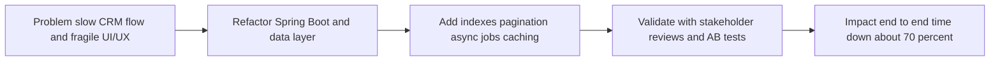
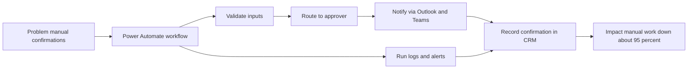

# Volkswagen-IT-Engineer

**Role:** IT Engineer (Part-Time: 24 hrs/wk)  
**When:** July 2023 – Dec. 2023 · **Location:** Taipei, Taiwan  

> **Disclaimer:** This portfolio uses sanitized descriptions and **synthetic examples only**.  
> No proprietary code, data, screenshots, internal IDs, or client configurations are included.

---

## Projects at a Glance

| Project | Problem | What I Built | Result | Stack |
|---|---|---|---|---|
| **P1. CRM “Recharge” Flow Refactor** | Slow end-to-end CRM flow and fragile UI/UX experience for ops | Refactored Spring Boot service with indexed queries, pagination, async jobs, caching—validated via stakeholder reviews and A/B tests | **End-to-end time ↓ ~70%** | **Java**, **Spring Boot**, **JPA/SQL (indexes)**, **Async tasks**, **Caching**, **A/B testing** |
| **P2. Purchase Confirmation RPA** | Manual CRM purchase confirmations were error-prone and time-consuming | Built a **Power Automate** workflow (automated bot) with approvals, logging, and alerts; integrated Outlook and Teams for status and notifications | **Manual work ↓ ~95%** | **Microsoft Power Automate**, **Outlook and Teams connectors**, **Approvals**, **Run logs** |
| **P3. Security Awareness & Workshops** | Patchy security habits across staff | Designed and distributed **weekly security posters** to all employees; hosted **3 internal workshops** on information security | Company-wide reach; reusable training assets | **Security awareness**, **Internal communication**, **Training content**  |

---

## Project Details

### P1 — CRM “Recharge” Flow Refactor
**Problem.** Slow end-to-end CRM flow in Recharge process and a fragile UI/UX experience reduced ops productivity.  
**Solution.** Refactored the **Spring Boot service** and data access layer with **indexed queries, pagination, async jobs, and caching**; validated improvements through **stakeholder reviews** and **A/B tests**.

**Highlights**
- **Optimized data access:** Added **selective indexes**, removed **N+1 patterns**, and converted heavy list endpoints into **paginated queries**.
- **Reliability and speed:** Moved long-running work to background jobs; added sensible **timeouts**, **retries** and cached stable lookups with clear **invalidation**.
- **Quality gates:** Basic latency and error SLIs per release; A/B experiments to confirm UX and performance gains.
- **UI/UX improvements:** Ran lightweight user research with **stakeholder interviews** to identify friction points; simplified **forms and navigation**, clarified **labels and loading states**, and added **inline validation**.

**Impact**
- **End-to-end time ↓ ~70%**; smoother and more resilient ops experience.

---

### P2 — Purchase Confirmation RPA
**Problem.**  Manual CRM purchase confirmations process were error-prone and time-consuming because it requires manual entry.
**Solution.** Built a Power Automate workflow (automated bot) with **approvals, logging, and alerts**; integrated Outlook and Teams for status visibility and notifications.

**Highlights**
- **Event-driven flow:** Triggers on new purchase events, validates inputs, and routes to the correct approver with one-click actions.
- **Observability:** **Run logs** for every execution, exception capture, and **alerting** for retries or human review.
- **Governance:** Permissioned **connectors** and **auditable history** for compliance.

**Impact**
- **Manual work ↓ ~95%**; faster, consistent confirmations with traceable outcomes.

---

### P3 — Security Awareness and Workshops
**Problem.** Patchy security habits across all company's employers.
**Solution.** Designed and distributed weekly security posters to all employees and hosted 3 internal workshops on information security.

**Highlights**
- **Clear and actionable content:**  Phishing recognition, password/MFA hygiene, safe GenAI/ChatGPT usage, and everyday data-handling tips.
- **Reusable assets:** Templated **posters** and **slide decks** that teams can re-use and localize.
- **Continuous improvement:** Collected FAQs and common scenarios to refine future sessions and materials.

**Impact**
- Company-wide reach and reusable training assets that improved baseline security awareness.
- 
---
