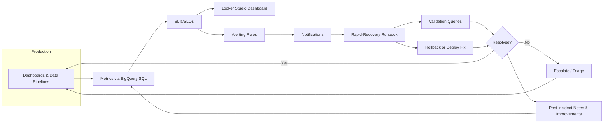
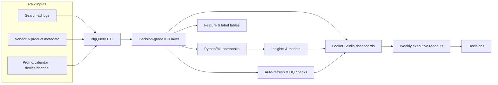
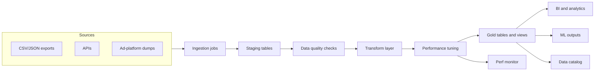
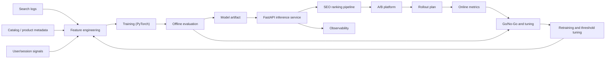
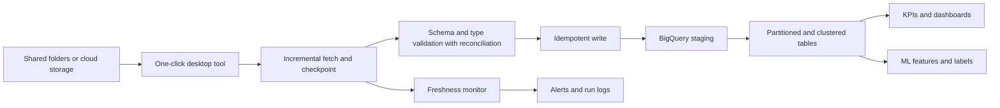
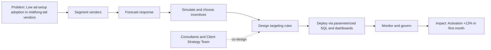

# Volkswagen-IT-Engineer

**Role:** IT Engineer (Part-Time: 24 hrs/wk)  
**When:** July 2023 – Dec. 2023 · **Location:** Taipei, Taiwan  

> **Disclaimer:** This portfolio uses sanitized descriptions and **synthetic examples only**.  
> No proprietary code, data, screenshots, internal IDs, or client configurations are included.

---

## Projects at a Glance

| Project | Problem | What I Built | Result | Stack |
|---|---|---|---|---|
| **P1. CRM “Recharge” Flow Refactor** | Slow end-to-end CRM flow and fragile UIUX experience for ops | Refactored Spring Boot service with indexed queries, pagination, async jobs, caching—validated via stakeholder reviews and A/B tests | **End-to-end time ↓ ~70%** | **Java**, **Spring Boot**, **JPA/SQL (indexes)**, **Async tasks**, **Caching**, **A/B testing** |
| **P2. Purchase Confirmation RPA** | Manual CRM purchase confirmations were error-prone and time-consuming | Built a **Power Automate** workflow (automated bot) with approvals, logging, and alerts; integrated Outlook and Teams for status and notifications | **Manual work ↓ ~95%** | **Microsoft Power Automate**, **Outlook and Teams connectors**, **Approvals**, **Run logs** |
| **P3. Security Awareness & Workshops** | Patchy security habits across staff | Designed and distributed **weekly security posters** to all employees; hosted **3 internal workshops** on information security | Company-wide reach; reusable training assets | **Security awareness**, **Internal communication**, **Training content**  |

---

## Project Details

### P1 — Data Platform Reliability & Recovery
**Problem.** Manual checks for dashboard and data pipeline health created toil and slowed incident response.  
**Solution.** Programmatic **health checks** and **alerting** backed by BigQuery-derived SLIs and SLOs, plus a **rapid-recovery runbook**.

**Data/ML-oriented highlights**
- **SLIs/SLOs:** freshness lag, DAG latency, error rates; computed with **BigQuery SQL** window analytics and surfaced in **Looker Studio**.
- **Anomaly detection:** rolling-window thresholds (p90/p95) trigger alerts; noisy spikes damped with simple moving averages.
- **Operations:** runbooks with validation queries, rollback and forward procedures, and post-incident notes for continuous improvement.

**Impact**
- **Manual monitoring ↓ ~8 hrs/week**; faster mean-time-to-detect and mean-time-to-recover.

---

### P2 — Search-Ad Analytics
**Problem.**  Decision cycles needed a decision-grade data layer and to extract revenue-driving, model-optimizing insights from search-ad data.
**Solution.** Built a decision-grade analytics layer in BigQuery and a Python, ML pipeline for feature engineering, cohort clustering, and supervised classification/regression, and time-series baselines to extract insights that drive revenue from search-ad logs and optimize e-commerce ad models; delivered reusable SQL (CTEs/windows) and notebooks that power weekly executive readouts.

**Data/ML-oriented highlights**
- **Insight mining:** Partnered with consultants and client strategy teams to build **BigQuery SQL and Python/ML analyses** that surface e-commerce search-ad insights; translated raw logs into creative actions. For example: (1) Cohort clustering of vendors by adtype mix and spend elasticity. (2) Uplift cuts to spot segments responsive to keyword expansion. (3) Funnel drop-offs by device and time-of-day to guide bid scheduling. (4) Query-term cannibalization detection across campaigns.
- **Decision support:** Delivered reusable, **parameterized SQL (CTEs/windows) and versioned Python notebooks** that power weekly executive readouts in Looker Studio and BigQuery views; **automated refresh, DQ checks, and promo-window slicing** to keep KPIs consistent.
- **Metric modeling:** Built **clustering, classification, and regression models** with features for seasonality, device, channel, and query intent; evaluated via **cross-validation** and shipped lightweight **predictors** in tables/APIs (scikit-learn/XGBoost). For example: (1) Propensity scoring to rank vendors for incentive trials. (2) ROAS-lift regression to size bid increases. (3) Classifier to flag underperforming keywords for pause. (4) Time-series baselines to forecast daily spend/clicks.

**Impact**
- Established a **decision-grade KPI layer** used across teams, supporting exec decisions with 4-5 analytic cases weekly.
- Cut **time-to-insight to same-day** via parameterized BigQuery views and auto-refreshed Looker studio dashboards.
- Produced **model-ready features and labels**, accelerating ranking and targeting experiments.

---

### P3 — SQL Codebase Refactor & Data Ingestion and Extraction Pipelines
**Problem.** Slow, costly queries and repeated ad-hoc pulls hurt velocity and consistency.  
**Solution.** Refactored SQL and standardized KPI code; shipped **automated ingestion and extraction** with schema contracts.

**Data/ML-oriented highlights**
- **Faster queries, lower cost:** Applied date **partitioning** and **clustering** on large tables, simplified heavy CTEs, and verified gains with **bytes-scanned** checks, resulting in faster runs and lower cost.
- **Parameterized codebase:** Converted duplicated SQL into **reusable templates and parameterized views**, moved constants to **reference tables/UDFs**, table value function (TVF), and added lightweight macros, achieving less copy-paste, fewer errors, and one query serving many slices.
- **Reproducible, model-ready outputs:** Deterministic scheduled jobs publish versioned, documented gold tables and views with schema contracts and lineage tracking. The datasets are query-ready for BI and analytics and supply feature and label tables for ML training and inference.

**Impact**
- **Runtime & cost ↓ ~40%**; pipelines underpin **~95%** of analyses and dashboards.

---

### P4 — Keyword Product Relevance-Scoring API with Machine Learning Model for Search Engine Optimization (SEO)
**Problem.** A/B cycles for SEO ranking were slow, and keyword–product relevance scores lacked accuracy, limiting measurable lift. 
**Solution.** A **Python REST API** that serves a trained **PyTorch** model to score keyword–product pairs for the SEO ranking pipeline.

**Data/ML-oriented highlights**
- **Modeling:** Engineered features from query and product text (tokenization, n-grams, embeddings), behavioral signals (co-click/co-purchase, dwell time), and lexical–semantic similarity (BM25, cosine, edit distance). Trained a **PyTorch** classifier/regressor with class weighting and early stopping; tuned via stratified cross-validation. Evaluated with **AUC-PR** and ranking metrics (**NDCG@k**, MAP), ran ablations, and calibrated scores (Platt/Isotonic) for stable thresholds.
- **Serving:** Deployed a **FastAPI** microservice with a **TorchScript** model for low-latency inference. Requests are schema-validated and micro-batched; hot pairs are cached.
- **Experimentation:** Integrated with the **A/B platform** via feature flags and score thresholds, with predefined win criteria and guardrails (CTR, CVR, revenue, latency). Used staged rollout (shadow → 5% → 25% → 100%) with stop-loss triggers.

**Impact**
- **A/B iteration ↑ from ~1 → 3 tests/week**, accelerating learning and ranking improvements.

---

### P5 — Event-Driven Ad-Traffic Collector
**Problem.** Manual retrieval and laggy availability delayed downstream analytics and experiments.  
**Solution.** **Event-driven Python collector** with incremental fetch, retries, and idempotent writes to ready-to-query tables.

**Data/ML-oriented highlights**
- **Automation & one-click UX:** Python collector automates incremental ingestion of traffic files (e.g., CSV/JSON) from shared folders or cloud storage, packaged as a **one-click desktop tool** so non-technical users can fetch data on demand or on a schedule.
- **Freshness & observability:** BigQuery computes end-to-end ingestion lag and file-to-table completeness; the tool logs run metadata and raises alerts when freshness or row-count thresholds are breached.
- **Reliability & data quality:** Checkpointing and idempotent writes prevent duplicates; schema and type checks and reconciliations catch anomalies; partitioned and clustered tables keep queries fast and produce **model-ready** inputs for KPIs and features.

**Impact**
- **Retrieval latency ↓ ~88%**; fresher signals for KPIs, model training, and A/B tests.

---

### P6 — Incentive Targeting Analytics for Mid/Long-Tail Vendors
**Problem.** Low adoption of ad setup among mid/long-tail vendors, suppressing ad spend and revenue.
**Solution.** **Segmented vendors** by ad-setup behavior and partnered with consultants and the client’s strategy team to design **targeting rules** that raised ad-setup activation.

**Data/ML-oriented highlights**
- **Segmentation:** Segment vendors with **K-means or hierarchical clustering** (optionally PCA) to surface mid/long-tail cohorts with low ad-setup adoption and high lift potential.
- **Incentive design and Prediction:** Use uplift and propensity models to forecast segment response, then choose the best incentive (ad credits/discounts, ready-made campaign bundles, or short-term managed setup by our team) via a lightweight policy simulator to maximize activation and ROI.
- **Tracking and Governance:** SQL rules and dashboards that ops can apply without code changes; monitoring for post-launch drift after targeting rules are applied.

**Impact**
- **Activation rate ↑ ~13%** in targeted cohorts during first-month rollout.

